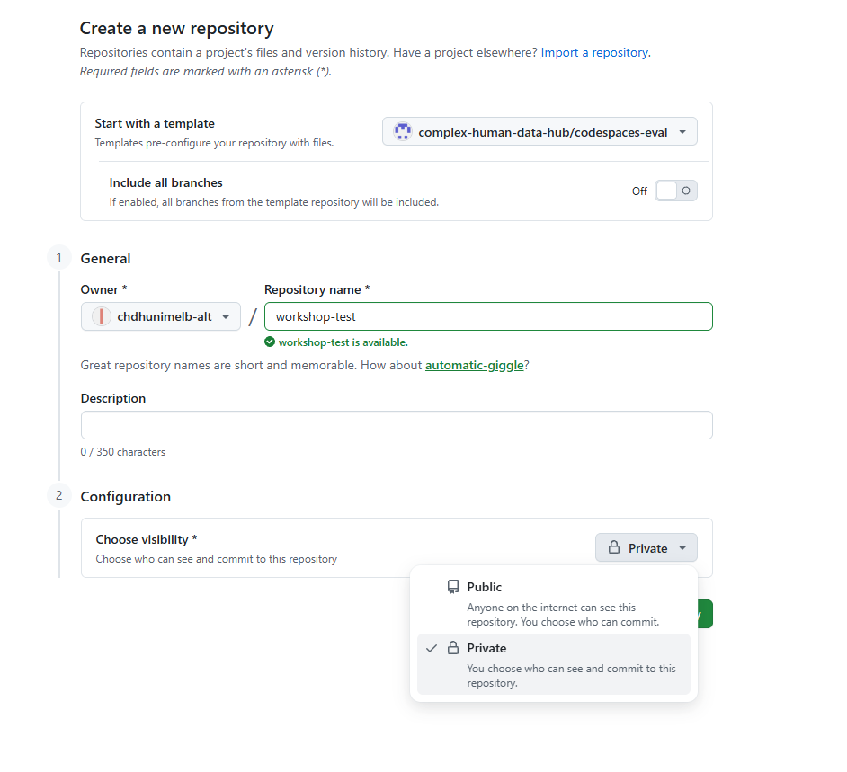
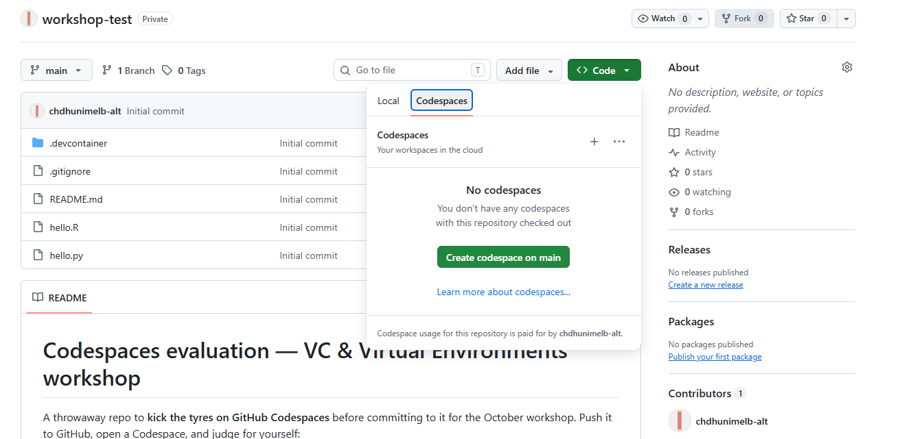
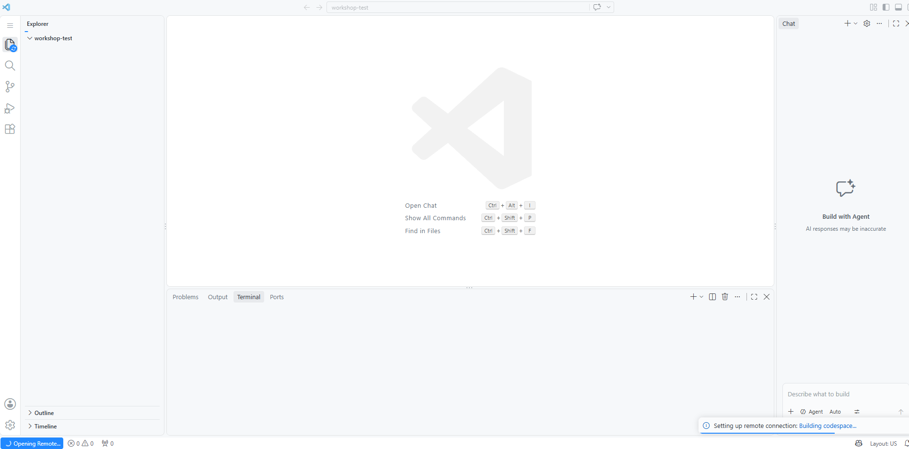
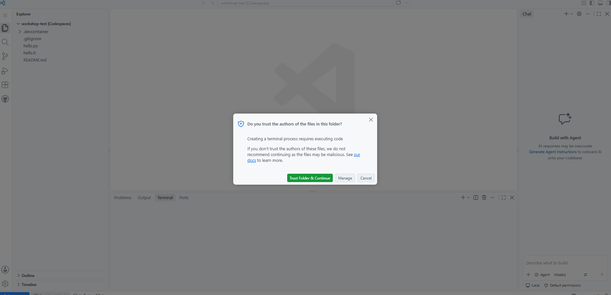
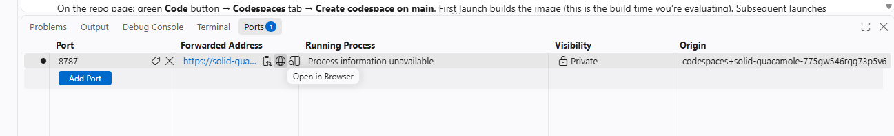

# First steps

> **Draft preview** — this page is being built for the October 22 workshop.

Welcome! This page gets you a complete, ready-to-code workshop environment — **in your
browser, with nothing to install**. It takes five clicks and about ten minutes, almost
all of which is waiting you can do with a coffee.

## Before you start: one thing you need

A **free GitHub account** — sign up at [github.com/signup](https://github.com/signup) if
you don't have one. Signing up with your Google account works and skips email verification.

That's the only prerequisite. Windows, Mac, Linux, a borrowed laptop — all fine. Everything
runs in the browser.

## Step 1 — Make your own copy of the workshop materials

Signed in to GitHub, open the workshop repository link (we'll share it), and click the green
**Use this template → Create a new repository** button.

On the form:

- **Owner:** your account (already selected)
- **Repository name:** anything you like — `vc-workshop` works
- **Visibility:** choose **Private** (the form defaults to Public — flip it)

Click **Create repository**. You now own a complete copy of the materials — this is *your*
repository, and everything you do in the workshop happens in it.

## Step 2 — Launch your codespace

On your new repository's page: click the green **Code** button → **Codespaces** tab →
**Create codespace on main**.

> **"Paid for by you"?** That footer means the codespace runs on your account's **free
> monthly allowance** (120 core-hours — the whole workshop uses about 4). No payment
> details are involved, and GitHub stops rather than charges if you ever run out.

## Step 3 — Wait out the build (~8 minutes) ☕

Here's the one confusing part. Almost immediately you'll see what looks like a finished
editor — **with no files in it**:

**It's not broken, and it's not done.** The small "Building codespace…" message in the
corner is the real progress indicator. Your environment — a complete Linux machine with R,
RStudio, Python and git — is being assembled behind the scenes. Leave the tab alone.

**It's ready when your files appear in the list on the left.**

## Step 4 — Click "Trust Folder & Continue"

When the build finishes, a dialog asks whether you trust the authors of this code:

The author is **you** — you created this repository in Step 1. Click the green
**Trust Folder & Continue**. (Clicked Cancel by accident? Just reload the page.)

While you're at it: your browser may also ask permission for the **clipboard** — click
**Allow**. That's what lets you copy-paste commands during the workshop.

## Step 5 — Open RStudio

At the bottom of the editor, find the **Ports** tab (next to Terminal). Hover over the
**8787 "RStudio Server"** row and click the **globe icon** (Open in Browser):

RStudio opens in a new tab, no login needed.

> ⚠️ **Always use the globe icon** — don't type the address by hand, and don't change the
> port's visibility (Private is what keeps your RStudio yours). If the new tab sticks on
> *"getting your codespace ready"* for more than half a minute: go back to the Ports panel,
> use the **copy icon** to copy the address, and paste it into a new tab once — after that
> the globe works normally.

## Done — now stop it

You're set up. Two housekeeping habits:

- **Stop your codespace** when you're not using it: [github.com/codespaces](https://github.com/codespaces)
  → **⋯** next to your codespace → **Stop codespace**. (It also stops itself after 30 idle
  minutes.)
- **Reopening is fast:** next time, the same page → click your codespace → running again in
  under a minute. If you've done this page before the workshop, your setup on the day takes
  **less than 60 seconds**.

## If something went wrong

| Symptom | Fix |
|---|---|
| "Create codespace" asks me to verify my email | Verify it (GitHub sent you a link), then retry |
| Editor appeared but stays empty > 10 min | Reload the tab; if still stuck, delete the codespace and create it again |
| I clicked Cancel on the trust dialog | Reload the page, click **Trust Folder & Continue** |
| RStudio tab stuck "getting your codespace ready" | Ports panel → copy icon → paste address into a new tab once |
| Copy-paste doesn't work | Click the padlock in the address bar → allow Clipboard |

Still stuck? Bring it to the workshop — the first fifteen minutes are set aside for exactly
this, and two helpers will be roaming.
